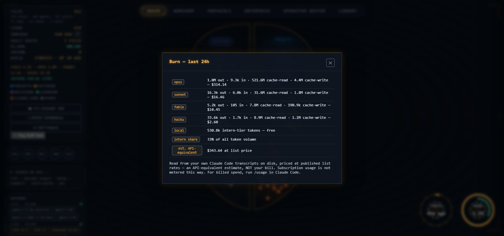
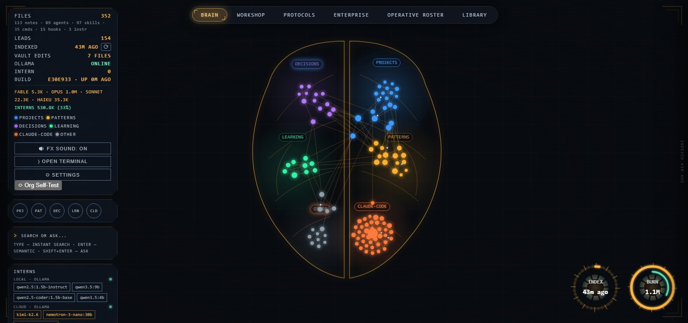
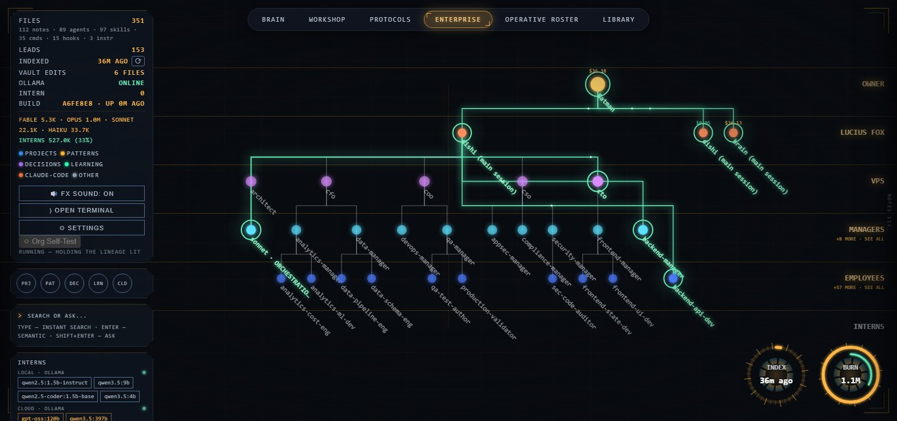
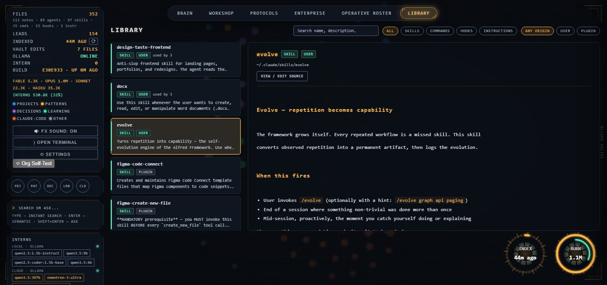
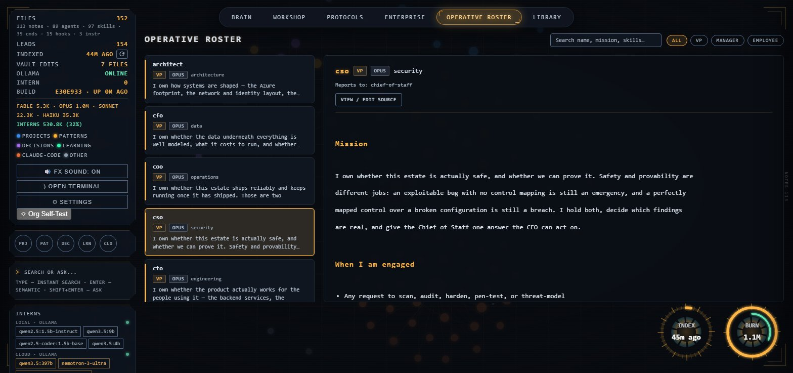
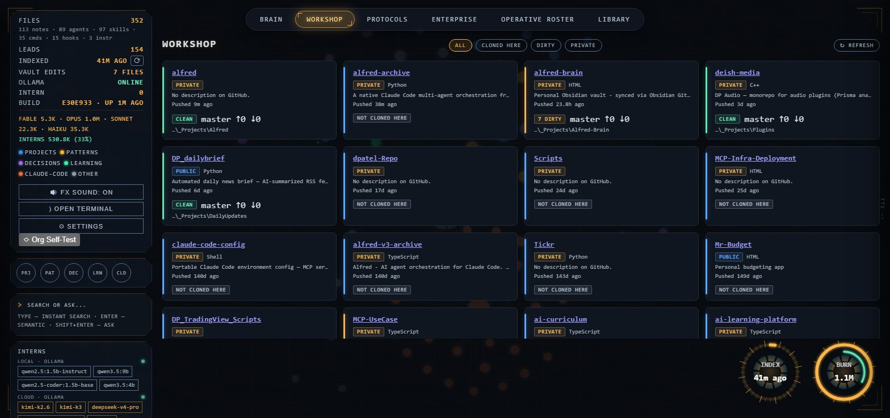
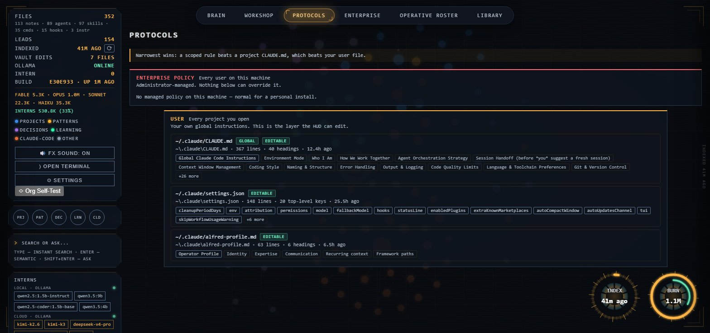

# The Alfred Framework

[](LICENSE)
[](https://github.com/dpatel-93/alfred/stargazers)
[](#quickstart)

**A.L.F.R.E.D.** — **A**gentic **L**abor **F**orce for **R**esearch, **E**ngineering, and
**D**elivery. Same idea as Batman's butler, aimed at a different job: instead of running
Wayne Manor and staying two steps ahead of Gotham, Alfred runs your engineering work —
research, delivery, the org chart that gets it done — while you stay the one making the
calls.

**Alfred is a model-tiered agent orchestration framework for Claude Code.** It keeps every
agent, skill, command and instruction you own local and indexed, then loads only the slice a
job needs — so work is routed down a real chain of command instead of being handled at one
undifferentiated tier with everything in context.

It is one system in three parts: an interactive **HUD** (a graph of your notes, one search
across everything, a live org chart, and a library of every artifact your agents can use), a
**brain** (a plain-markdown folder of your own notes), and a Claude Code **orchestration
layer** that routes agent work down a model-tiered org chart. Not a separate front-of-house
assistant and a separate back-of-house framework — Batman's butler, doing both.

The HUD is deliberately an **observe** surface. You run `claude` in your own terminal, where
the real tool already works; the HUD shows you what that produced — which agents ran, down
which chain of command, at what cost, against which notes and skills. It is not a second,
worse place to type.

The HUD, semantic search, and server code lives in `brain/`; the Claude Code
framework it orchestrates lives in `agents/`, `skills/`, `commands/`, and
`helpers/`. Everything is branded Alfred.

### The problem this is actually solving

Every organisation adopting AI coding assistants hits the same wall: people reach for the
best available model for every task, because "best" is the obvious default and nobody wants
to explain a worse answer. The bill follows. The instinct is then to ration access, which
trades the cost problem for a capability problem.

Alfred takes the third option — the one every functioning company already uses. **You do not
staff a company entirely with principals.** Work is decomposed and routed to the cheapest
tier that can do it correctly, with senior review where being wrong is expensive. Alfred
encodes that as infrastructure rather than as advice: every agent declares its model tier,
a hook enforces it at spawn time, and the whole ledger is on screen.

Alfred was built by its own org chart, so the ledger is its own evidence — this is a rolling
24-hour window from building it (snapshot **2026-08-10**), read from the local Claude Code
transcripts:



| Tier | Role | Output tokens |
|---|---|---|
| **Fable** | Top-tier adjudication only — gated behind an explicit confirmation | **5.2k** |
| **Opus** | Hard debugging, design review, adversarial verification | 1.0M |
| **Sonnet** | Default build tier — coding, generation, moderate complexity | 16.3k |
| **Haiku** | Search, file sweeps, bulk mechanical work | 33.6k |
| **Local (Ollama)** | Drafts, summaries, embeddings — **free**, always reviewed by a higher tier | **530.8k (33% of all volume)** |

Two numbers carry the argument. The frontier tier is **5.2k tokens** — not because it was
rationed, but because almost nothing genuinely required it. And **33% of all token volume
never touched a paid API at all**, because a local model on the same machine is good enough
to draft, summarise and embed, provided something above it reviews the output.

A third number is arguably the most useful one here, and it is in the screenshot rather than
the table: Opus read **515.9M cache tokens** against that 1.0M of output. Cached context is
re-sent on every turn, so the dominant term in a bill is usually not what the model wrote —
it is how much you asked it to carry. Which model you pick matters less than how much you
load before it starts.

The Opus/Sonnet split moves with the kind of day, and this is a rolling 24-hour window rather
than a lifetime total — the snapshot above is an architecture-and-debugging day, which lives
in the main session and therefore in Opus. A day of building against a settled design inverts
it. Those two numbers are quoted rather than the ratio between the paid tiers precisely
because they are the ones that hold whichever kind of day you catch it on.

That is the thesis: you do not need the frontier model for every task. You need a labour
force — including free local models — and enough structure that the expensive tiers spend
their time reviewing and directing rather than typing.

### Why Alfred, not another agent-orchestration repo

Most Claude Code agent collections take one of two shapes: a large, flat roster of
specialist-prompt agents you drop in and activate by name (hundreds of agents across
many divisions, personality-driven), or a plugin marketplace with its own generate/
validate tooling that targets several coding harnesses at once (Codex, Cursor, Gemini,
Copilot) from one source tree. Both are legitimate approaches, and better suited than
Alfred if what you want is maximum breadth or multi-tool reach. Alfred optimizes for a
different thing: **a small, curated, real chain of command inside Claude Code alone.**

| | Flat prompt collections | Multi-harness plugin marketplaces | **Alfred** |
|---|---|---|---|
| Roster shape | Large & flat (100s of specialists, no reporting structure) | Large & plugin-scoped (100s of agents, granular install) | Small & hierarchical — 55 agents in an actual chain of command |
| Roster philosophy | Breadth: a specialist for nearly every framework/platform | Breadth via install-what-you-need | Curated: real, durable career roles only — no framework-of-the-month agents |
| Structural validation | Not typically enforced | Yes — static + LLM-judge + reliability checks | Yes — every delegation target, skill reference, and capability claim is validated (`helpers/validate-org.mjs`) before it ships |
| Cost-tier discipline | Model choice is usually per-agent, not policy-driven | Explicit model tiers per plugin | Explicit model tiers **tied to measured session cost**, enforced by a gate hook, not just documented |
| What you get beyond agents | Agent prompts only | Agents + skills + commands | Agents + skills + commands + a real local **HUD** (graph, unified search, live org chart) over your own notes |
| Target surface | Claude Code (some also Cursor/Copilot) | 5-6 harnesses from one source | Claude Code, deliberately — depth over breadth |
| Contribution model | Usually PR-friendly | Usually PR-friendly | Suggestions via Issues/Discussions; the roster and framework structure stay curated (see [Contributing](#contributing)) |

The org chart itself is the other half of "targeted." Alfred isn't a bag of agents you
call by name — it's structured the way an actual company is, with a real chain of
command: you (the CEO) set direction, and the main session acts as **Chief of Staff**,
routing work down through model-tiered VPs, managers, and employees, then handing back
one synthesized answer instead of a pile of subagent transcripts. Think of it less like
"Batman personally checks every department" and more like how Wayne Enterprises actually
runs — Bruce Wayne sets direction and makes the calls that matter, while someone else
(call it Alfred running the manor, or Lucius Fox running the company day-to-day) handles
the org beneath him so he can stay focused on the thing only he can do. That's the model:
you stay the one making decisions; Alfred runs the org that executes them.

### A look inside

Alfred's HUD is an **observe** surface, not a control panel. You run `claude` in your own
terminal; the HUD shows you what that produced and what the framework has to work with.
Nothing below is a mockup — every screenshot is the running product against a real install.
The tallies in the left rail describe that whole install, so they count everything installed
plugins contribute alongside Alfred's own; Alfred ships the 55 chartered agents set out below,
not the 89 the rail happens to see on this machine.

**The Brain — your notes as an organ, lit by what has actually been touched.**
Each folder owns a cortical region, and the force layout pulls its notes into it, so
clustering lands somewhere meaningful instead of somewhere arbitrary. Regions brighten and
ripple based on real note mtimes, decaying over six hours — a region glows because something
happened there, never on a timer.



**The org chart, with a real delegation lit end to end.**
Read directly from Claude Code's own transcripts on disk — the lineage below is one request
decomposed five levels deep: you at the top, the main session as Chief of Staff, then a VP, a
manager, and an employee agent, each running in its own context window and each carrying its
rolled-up spend. So "which part of the org is this costing me" is a glance, not an
investigation.



An edge only glows when both of its ends are active, and in a real delegation that is rarely
true of the whole chain at one instant — the employee works while the manager waits. The
`Org Self-Test` button runs a genuine VP → manager → employee delegation that does nothing but
pass a word down and back, and holds the window open long enough to see the shape of it. That
is how the shot above was taken: a real chain, not a diagram.

**The Library — every artifact on disk, with its real source.**
Skills, commands, hooks and instruction files from both your own `~/.claude` and every
installed plugin, each showing where it came from and which agents reference it.



**The roster, as charters rather than a list of names.**
Every agent's actual mission, its tier, its model, who it reports to, and — importantly —
what it is explicitly *not* the right owner for.



**The Workshop — your repositories, with local clone state.**
Live from the GitHub API, matched to local clones by **git remote rather than folder name**,
so a renamed directory does not silently detach from its repo. Branch, ahead/behind, and dirty
file count per card.



**Protocols — the instruction hierarchy, drawn as it actually resolves.**
Enterprise policy, your user files, project files, scoped rules. Note the header: the pyramid
draws widest-scope-at-top, but **precedence runs the other way** — the narrowest file that
speaks to a question wins. Every tier repeats that, because a shape implying the opposite would
be worse than no shape.



**The ledger, per tier, with the cache split visible.**
Output, input, cache reads and cache writes per model family, priced at published list rates —
an **API-equivalent estimate, not a bill**, since subscription usage is not metered this way and
`/usage` in Claude Code remains the source of truth for billed spend. It is
[shown up top](#the-problem-this-is-actually-solving), because the cache-read figure in it is
the most useful number on this page.

**One search across everything the agent can use.**
Notes, agents, skills, commands, hooks and instructions in a single ranked list — fuzzy and
instant per keystroke, with a deeper semantic pass behind Enter. Clicking a result goes to
wherever the thing actually lives. *(No screenshot of this one: result rows render note titles,
file paths and a line of body text from whatever is actually indexed, so every capture of it
published someone's private notes — seven candidate queries were tried and none came back
clean. Run it and you get yours.)*

## Architecture

```
                       THE BRAIN LAYER (brain/)
  ------------------------------------------------------------------
  your brain folder  (plain markdown files, synced however you like -
                       OneDrive, Dropbox, git, a bare local folder)
        |
        | walk + embed each note (local Ollama, nomic-embed-text)
        v
  index-vault.mjs  ---------------------------------->  index.json
        |                                                   |
        | (incremental: unchanged files are skipped)        | loaded by
        v                                                   v
  query.mjs  (CLI search, no server needed)           server.mjs :7777
                                                              |
                                          +-------------------+-------------------+
                                          |                   |                   |
                                  GET /api/*                    POST /api/ask
                              (status/graph/search/          (a short answer composed
                               search-index/library/org)      from your top notes)
                                          |                             |
                                          v                             v
                                   ui.html  --  the HUD: cortical graph, unified search,
                                                 org chart, roster, library


                CLAUDE CODE LAYER  (everything else in this repo)
  ------------------------------------------------------------------
  CLAUDE.md   (the constitution: who you are, how we work, hard rules)
        |
        v
  agents/     (model-tiered: Fable -> Opus -> Sonnet -> Haiku -> local Ollama)
        |
        v
  skills/     (loaded on demand: vault-recall, evolve, ollama-interns, ...)
        |
        v
  commands/   (slash-command prompt library: /fanout, /review-loop, /harvest, ...)
        |
        v
  hooks/ + helpers/   (session capture, memory sync, intern usage logging)
```

The two layers don't depend on each other to run — the HUD works with zero
Claude Code config installed, and the orchestration framework works with zero
brain indexed. Together, Alfred's agents can call the `vault-recall` skill to
query the same index directly instead of guessing filenames.

## Prerequisites

- **Node.js 20+, git.** The Claude Code orchestration layer (agents/skills/commands/helpers)
  installs cross-platform via `install.ps1` (Windows) or `install.sh` (macOS/Linux). The HUD
  layer in `brain/` (`server.mjs`, `index-vault.mjs`, `query.mjs`) is plain Node.js and should run
  anywhere, but its autostart helpers (`Alfred.cmd`, the `.vbs`/`Install-Alfred*.ps1` scripts) are
  Windows-specific today — on macOS/Linux, run `node brain/server.mjs` directly instead.
- **[Ollama](https://ollama.com)**, running locally, with:
  ```
  ollama pull nomic-embed-text
  ollama pull qwen2.5:1.5b-instruct
  ```
  `nomic-embed-text` powers search (required). `qwen2.5:1.5b-instruct` is the
  default ask model — it fits fully in 8GB of VRAM alongside the embedder,
  so answers come back in a few seconds. Optionally also
  `ollama pull qwen3.5:4b` for noticeably better answer quality at the cost of
  10-60+ seconds per answer (`ALFRED_ASK_MODEL=qwen3.5:4b` to switch).
- **Claude Code** — the CLI, or the VS Code extension. Either reads `~/.claude/`.
- **No runtime dependencies.** The server, the indexer and the HUD are plain
  Node — nothing to `npm install` before running Alfred. Text-to-speech was the
  only package the server ever needed, and it was removed along with the voice
  layer, so there is no 80MB ONNX runtime to download and no runtime supply
  chain to keep patched. The only `package.json` entry left is Playwright, a
  devDependency used solely by the browser test suite; `npm install` inside
  `brain/` is needed only if you intend to run those tests.
- **Any markdown editor works for hand-editing brain notes** — VS Code,
  Obsidian, Notepad, whatever you like. The brain is just a folder of `.md`
  files; Alfred doesn't call any editor's API or require one to be installed.

## Quickstart

**Recommended**: clone the repo, then open it in Claude Code (CLI or IDE extension) and just say
*"install this"* or *"set up Alfred."* `CLAUDE.md` triggers `ONBOARDING.md`, a short conversation
that asks who you are, your strong/learning areas, and whether you have a notes vault — then runs
the installer for you. This produces a proper `~/.claude/alfred-profile.md` instead of leaving you
to hand-edit personalization into framework files after the fact.

```bash
git clone https://github.com/dpatel-93/alfred.git alfred
cd alfred
# now tell your Claude Code session: "install this"
```

**Manual path**, if you'd rather skip the conversation:

```powershell
# Windows
.\install.ps1              # preview first with: .\install.ps1 -DryRun
```
```bash
# macOS/Linux
./install.sh               # preview first with: ./install.sh --dry-run
```
Both installers are idempotent and merge-only: they back up anything about to be
touched, copy `agents/`, `skills/`, `commands/`, and `helpers/` into `~/.claude/`
(merging, never deleting your own files), install the two `CLAUDE.md` files, and
scaffold a blank `~/.claude/alfred-profile.md` if one doesn't already exist — fill
it in by hand (see `claude-md/alfred-profile.template.md`) or just ask Claude to
run `ONBOARDING.md` afterward. If you already have a `~/.claude/settings.json`,
the installer writes a `settings.merged-proposal.json` next to it instead of
overwriting — merge the hooks/permissions you want by hand.

```powershell
# Point Alfred at your notes (skip this to run with no vault configured)
$env:ALFRED_VAULT = "C:\Users\you\Notes"

# Build the search index (first run embeds everything; reruns are incremental)
node brain\index-vault.mjs

# Launch (Windows)
brain\Alfred.cmd
# Launch (macOS/Linux)
node brain/server.mjs
```

That starts the server and opens `http://localhost:7777` in your browser (the
Windows launcher opens it automatically; on macOS/Linux, open it yourself). If
you don't set `ALFRED_VAULT`, nothing indexes — the HUD still runs, just empty.

```powershell
# 7. Optional: make it start automatically at logon (pick one)

# Route A - needs an elevated (Run as Administrator) PowerShell:
powershell -ExecutionPolicy Bypass -File brain\Install-AlfredAutostart.ps1

# Route B - no admin rights needed, runs from your Startup folder instead:
powershell -ExecutionPolicy Bypass -File brain\Install-AlfredStartup.ps1
```

Both are idempotent and both take `-Uninstall` to remove themselves. If Route A
fails with "Access is denied" (Task Scheduler needs elevation it doesn't have),
it prints the Route B command for you automatically.

## Using Alfred

Six views across the top; number keys `1`-`6` switch between them, `?` lists every
shortcut. Search is global — it works from any view.

### Reading the status line

The installed status line prints something like
`Opus 5 | Alfred | master | ctx 49% | ≈$305 api-eq | 5h 74%`. Two of those are worth
explaining because they are routinely misread:

- **`≈$N api-eq`** is what **this session's** tokens would cost at list API prices. If you
  are on a Pro or Max subscription, nothing is billed per token and this is a meter reading
  rather than an invoice — a $305 session on a $200/month plan is not a $105 overrun, it is
  a long session. It is also per session, not per month. `/usage` in Claude Code is the
  authority on what you have actually consumed against your plan; on API billing this figure
  happens to be the bill.
- **`ctx N%`** is context used against your configured compaction window, and it is the
  reason the cost figure climbs the way it does. The whole context is re-billed every turn,
  so cache reads dominate — 97.3% of all billed tokens, measured over 18 days of real
  transcripts here — and session cost is therefore roughly **quadratic in turns**, not
  linear. Past 50% the marker turns yellow and adds `COMPACT`.

`5h N%` only appears once the five-hour rate-limit window passes 70%, because a window at
12% is not information. On a subscription that number, not the dollar figure, is the one
that governs you.

| View | What it shows |
|---|---|
| **Brain** | Your notes as a cortical graph, regions lit by recent activity |
| **Workshop** | Your live GitHub repositories, with local clone state merged in where a clone exists |
| **Protocols** | Every CLAUDE.md and settings file governing this machine, as a scope pyramid — click one to read or edit it |
| **Enterprise** | The org chart, with live delegation lineage and per-branch spend |
| **Operative Roster** | Every agent's charter — mission, tier, model, reporting line |
| **Library** | Every skill, command, hook and instruction file, with its source and usedBy |

Protocols, the Operative Roster and the Library are also where you **edit** this stuff.
Clicking through to a file opens it as raw text, frontmatter included; changing it and
pressing Save shows a diff of exactly what will be written before anything is. The HUD only
writes your own `~/.claude` — plugin-installed files and a project's own CLAUDE.md open
read-only, and say why.

Everything else happens from the search bar:

| Action | What it does |
|---|---|
| Type | Instant fuzzy search across notes, agents, skills, commands, hooks and instructions — no round trip, works with Ollama offline |
| `Enter` | The deeper semantic pass — embedding search over your notes, with scores |
| `Shift+Enter` | Ask — composes a short answer from your top notes and reads them back |
| Click a result | Goes to wherever that thing actually lives: the graph, the Roster, or the Library |
| Category buttons (top-left) | Filter the Brain to one folder and fly the camera into its region; click again to pull back out |
| Click a node | Opens that note in the side panel, with its linked notes listed below |
| Reindex button (status rail) | Rebuilds the search index, with live progress; the Indexed stat next to it turns amber when the index is stale |
| Settings (status rail) | Where an optional free cloud-model key is entered; the saved key is proven against the provider, and a rejected key is reported in the Interns panel. Also where GitHub is connected for the Workshop view |

### API reference

Everything is served by `server.mjs` on `http://localhost:7777` (or your `PORT`). The table
below is the useful subset, not the full surface — there are 32 fixed routes plus two
parameterised agent ones, and the rest are per-view reads (`/api/projects`, `/api/charter`,
`/api/protocols`) and the agent and intern bridge routes.

The whole server binds to loopback only, and cross-origin preflights are refused outright, so
a random web page cannot reach it even from your own browser. On top of that, anything that
reaches outside the process — spawning an agent, opening a terminal, writing config, kicking
off a reindex — or that exposes agent output additionally requires a per-boot
`X-Alfred-Token` header. The `Gated` column below is the authority on which is which.

Two endpoints sit deliberately in between and are worth naming rather than glossing:
`/api/ask` is **ungated**, because it only runs local inference over notes you already own
and is read-shaped from a caller's perspective. It is still loopback-only. If you want it
behind the token too, that is one line in the router's allowlist.

| Method | Path | Gated | Purpose |
|---|---|---|---|
| `GET` | `/api/status` | — | Counts by kind, index freshness, Ollama state, session intern-token count, per-folder brain activity |
| `GET` | `/api/graph` | — | Full node + link graph for rendering the HUD |
| `GET` | `/api/search?q=...` | — | Top-10 semantic matches for a query, with scores |
| `GET` | `/api/search-index` | — | One flat manifest of everything searchable — notes, agents, and every Library artifact — matched client-side |
| `GET` | `/api/note?path=...` | — | Raw markdown for one note (path-traversal-guarded to the brain root) |
| `GET` | `/api/org` | — | The org chart, derived from Claude Code's own transcripts on disk |
| `GET` | `/api/agent-directory` | — | Every agent's charter metadata: tier, model, mission, reporting line |
| `GET` | `/api/library` | — | Every skill, command, hook and instruction file, with origin, source and usedBy |
| `GET` | `/api/library/item?id=...` | — | One artifact's full text, looked up in a closed map built at scan time |
| `GET` | `/api/protocols` | — | The CLAUDE.md/settings hierarchy in scope tiers, each entry with its headings and whether it is writable |
| `GET` | `/api/source?id=...` | — | One file's RAW text, frontmatter included — for the editor. Deliberately not the same as `/api/library/item`, which strips frontmatter for display |
| `POST` | `/api/source/save` | token | Writes a file back. Refuses anything outside your own `~/.claude`, anything a plugin installed, an mtime that moved since you opened it (409), and JSON that does not parse |
| `GET` | `/api/github/status` | token | Whether GitHub is connected, and by which route |
| `GET` | `/api/workshop` | token | Your repositories, with local clone state merged by git remote |
| `POST` | `/api/github/device/start` \| `/disconnect` | token | Starts an OAuth device flow, or clears the authorisation this HUD stored |
| `GET` | `/api/usage` | — | Token and cost tally by model tier |
| `POST` | `/api/ask` `{"q": "..."}` | — | Top-5 semantic matches composed into a short answer, plus `sources` |
| `POST` | `/api/reindex` | token | Rebuilds the index; progress is streamed via `GET /api/reindex/status` |
| `GET`/`POST` | `/api/settings` | token | Reads and writes local config. A saved cloud key is proven against the provider by an authenticated probe (a rejected key is reported in the Interns bench); the read path returns a mask, never the key |
| `POST` | `/api/agents/launch` | token | Spawns a subagent run; output via `GET /api/agents/<id>/output` |
| `POST` | `/api/org/selftest` | token | Runs a real VP → manager → employee delegation so the org chart has a genuine lineage to draw; state is published on `/api/org` as `selfTest` |
| `POST` | `/api/interns/run` \| `/pull` | token | Runs or downloads a local Ollama model |
| `POST` | `/api/claude/open-terminal` | token | Opens a real console resumed on your most recent idle session |

`/api/library/item` is worth calling out as a pattern rather than a route: the caller passes
an opaque id that is looked up in a map the server built by scanning its own directories. No
caller-supplied string ever reaches `path.join` or an `fs` call, which makes path traversal
*unrepresentable* rather than merely rejected. `/api/source` and `/api/source/save` — the only
route in the whole server that writes a file you own — use the same map.

**GitHub, without a token in your browser.** The Workshop view needs read access to your
repositories, and there are two ways to get it, neither of which involves pasting a personal
access token into a web page. If the [`gh` CLI](https://cli.github.com) is installed and
signed in, the server shells out to it and holds no credential at all. If it isn't, you can
paste an OAuth App **Client ID** — public by design, printed on the app's own settings page —
and run a device flow, where the server fetches the token straight from GitHub and stores it
in `~/.alfred/config.json` with owner-only permissions. Either way the token is never sent to
the page, and `/api/github/status` is asserted in the test suite to never return one.

### Config knobs (environment variables)

| Variable | Default | Effect |
|---|---|---|
| `PORT` | `7777` | Server port |
| `ALFRED_VAULT` | unset | Folder of `.md` files to index — set this to your own notes folder. `JARVIS_VAULT` is still read as a fallback for one release. |
| `ALFRED_ASK_MODEL` | `qwen2.5:1.5b-instruct` | Ollama model used by `/api/ask`; try `qwen3.5:4b` for better answers if you have the VRAM and patience. `JARVIS_ASK_MODEL` is still read as a fallback for one release. |
| `OLLAMA_URL` | `http://localhost:11434` | Where to reach Ollama, if not the default local install |
| `ALFRED_GITHUB_CLIENT_ID` | unset | GitHub OAuth App Client ID for the Workshop view's device flow. Not needed if the `gh` CLI is signed in, and not needed as a variable at all — the HUD's Settings panel takes it. A Client ID is public, not a secret. |
| `ALFRED_PROJECT_ROOTS` | `~/OneDrive/Desktop/_Projects` | Folders scanned for local git clones, used to annotate Workshop cards. Semicolon-separated. |
| `OLLAMA_API_KEY` | unset | Ollama Cloud key. Unlocks the cloud half of the Interns panel, so intern-tier work can run on a free hosted model instead of your own GPU. Get one at [ollama.com](https://ollama.com) → Settings → Keys. **You don't need this variable** — the HUD's own Settings panel takes the key and saves it to `~/.alfred/config.json`. Set it here only if you'd rather manage it as an environment variable; it takes precedence over the saved one. |
| `OLLAMA_CLOUD_URL` | `https://ollama.com` | Override the cloud endpoint (self-hosted or a compatible provider) |

### Naming the org chart's lanes

The lanes are generic by default — **Owner**, C-Suite, VPs, Managers, Employees, Interns. The
top one is *you*, the human running the install, which is why it says Owner rather than CEO:
one word meaning both the person and the top agent tier is what stopped the chart being able
to show a person delegating to the org.

Rename any of them per machine in `~/.alfred/config.json`:

```json
{ "orgLabels": { "owner": "Batman", "csuite": "Lucius Fox" } }
```

Read per request, so an edit needs no restart; an unset or blank value falls back to the
default rather than rendering an unlabelled lane. The top node's *name* comes from
`Address me as` in `~/.claude/alfred-profile.md`, so setting `owner` is only needed if you want
the lane itself renamed. There is deliberately no separate lane for a chief-of-staff persona:
Alfred running the manor and Lucius Fox running the company day-to-day are the same job, and a
tier with nothing in it reads worse than a label you can change.

### Optional MCP servers

`settings/mcp.reference.json` holds example MCP server configs — generic, third-party tool
servers (`stitch`, `21st-magic` for UI generation), not something this repo requires. Nothing
installs these automatically; copy the entries you want into this project's `.mcp.json` and
allow them via `settings.json`'s `enabledMcpjsonServers`. An earlier version of this file also
shipped an `azure-infra` entry pointed at one operator's own private Azure Container App — it
would have just hung for anyone else, so it's been removed rather than genericized; if you want
an Azure MCP server, point it at your own endpoint.

## Alfred orchestration

Once installed, Claude Code in this project routes work down a fixed org chart
instead of doing everything itself:

| Rank | Model | Role |
|---|---|---|
| CEO | You | Direction and approvals — the only human in the loop |
| C-suite | Opus (the main session) — Fable is gated behind an explicit confirmation | Architecture, orchestration, synthesis — delegates aggressively, never does bulk work itself |
| VPs | Opus | Hard debugging, design review, adversarial verification |
| Managers | Sonnet | Default coding subagents — most implementation work |
| Employees | Haiku | Parallel search, research, bulk mechanical work |
| Interns | Local Ollama | Free drafts/summaries/embeddings — **always reviewed by a higher tier before use, never shipped raw** |

Agent count is dynamic — the main session fans out as many cheap-tier
subagents as a task needs, never capped to an arbitrary number, and is more
deliberate about spawning multiple expensive Opus/Fable agents in parallel.

### The org chart

55 chartered agents — 5 VPs, 17 managers, 33 employees — organized as a real reporting
structure, not a flat pile of specialists. Every one of them is validated structurally
(`node ~/.claude/helpers/validate-org.mjs`): delegation targets must resolve, referenced
skills must exist, and an agent forbidding itself from self-executing must actually lack
the tools to do so. Counts are enforced by the validator, not by this table.

| VP (`opus`) | Domain | Managers (`sonnet`) | Employees (`haiku`) |
|---|---|---|---|
| `cto` | Product engineering | `backend-manager` | `backend-api-dev`, `backend-integration-dev` |
| | | `frontend-manager` | `frontend-ui-dev`, `frontend-state-dev` |
| | | `mobile-manager` | `mobile-rn-dev` |
| | | `docs-manager` | `docs-api-writer`, `docs-runbook-writer` |
| `architect` | System & infra design | `infra-manager` | `infra-terraform-eng`, `infra-network-eng`, `infra-identity-eng` |
| | | `platform-manager` | `platform-appservice-eng`, `platform-container-eng` |
| `cso` | Security & compliance | `security-manager` | `sec-code-auditor`, `sec-secrets-hunter`, `sec-config-auditor` |
| | | `compliance-manager` | `comp-control-mapper`, `comp-evidence-collector` |
| | | `appsec-manager` | `appsec-dep-scanner`, `appsec-threat-modeler` |
| | | `dr-manager` | `dr-continuity-eng` |
| `coo` | Delivery & reliability | `devops-manager` | `devops-pipeline-eng`, `devops-release-eng` |
| | | `qa-manager` | `qa-test-author`, `qa-browser-tester` |
| | | `sre-manager` | `sre-monitoring-eng`, `sre-incident-responder` |
| | | `vendor-manager` | `vendor-audit-eng` |
| `cfo` | Data, analytics, cost, markets | `data-manager` | `data-pipeline-eng`, `data-schema-eng` |
| | | `analytics-manager` | `analytics-ml-dev`, `analytics-cost-eng` |
| | | `quant-manager` | `quant-strategy-dev`, `quant-risk-analyst` |

Full charter contract (frontmatter schema, the nine required body sections, return
contracts up the chain) lives in `agents/ORG.md`. Growth is deliberate: agents get added
when a real, durable role is missing — not for every framework or platform that exists.
Have an idea for a role that's missing? Open an issue; see [Contributing](#contributing).

**Review-loop pattern**: anything shipped goes worker -> reviewer -> synthesis,
one tier up from whoever produced it. `/review-loop` automates this for
uncommitted changes: it runs a worker/reviewer/refiner cycle until a review
pass approves, capped at 3 iterations.

**Prompt library** (`commands/`, installed as slash commands):

| Command | What it does |
|---|---|
| `/fanout` | Decomposes a task into independent chunks, runs each as a parallel subagent at the cheapest tier that can handle it, then synthesizes the results |
| `/review-loop` | Worker/reviewer/refiner loop on the current uncommitted diff until approved (max 3 iterations) |
| `/harvest` | End-of-session capture — pulls decisions, patterns, and learnings out of the session into the brain |
| `/deep-debug` | Layered debugging for a hard bug: reproduce, isolate, then parallel per-layer investigators before verifying the fix |
| `/azure-audit` | Reviews Azure resources or Terraform IaC for security misconfigurations and cost issues |
| `/explain` | Teaches a concept, calibrated to what you already know, with an offer to save the explanation to the brain |
| `/plan-day` | Scans active project notes and recent git activity to propose the day's highest-leverage work |
| `/pr-desc` | Writes a small, focused PR description for the current branch's diff |
| `/intern` | One-off manual trigger to offload a draft/summary/mechanical task to the local Ollama tier |
| `/status` | One-screen status: repo/branch/changes, running background tasks, brain note freshness |
| `/tokens` | Token usage report — cloud spend by day/model plus local intern load, so you can see the cloud-vs-local ratio |

**Key skills** (`skills/`, loaded automatically when relevant):
- `vault-recall` — semantic search over the brain via this same nomic-embed
  index, so agents can ask "what do we know about X" instead of guessing
  filenames or re-deriving prior decisions.
- `evolve` — the self-evolution engine: turns a workflow that's repeated 2+
  times into a proper skill, command, or agent instead of re-explaining it
  every session.
- `ollama-interns` — the model matrix for the local intern tier (which model
  for which kind of grunt work) and the "always reviewed, never shipped raw"
  rule.
- Intern-run logging + `/tokens` — every local Ollama call for search/ask logs to
  `~/.claude/metrics/ollama-usage.jsonl`; `/tokens` turns that into a report.

**Self-evolution loop**: session-start/stop hooks capture what happened into
memory and the brain. When the same workflow shows up 2+ times, `/evolve`
promotes it into a skill or command so the next session doesn't re-derive it.
This repo is the durable, installable snapshot of that accumulated state —
after a meaningful change to your own `~/.claude/`, re-sync it back into this
repo and push.

**Personalize after install**: the two `CLAUDE.md` files in `claude-md/` are
framework templates — org-chart routing, hard rules, and orchestration
mechanics meant to be shared as-is. Personal identity (name, role, strong/
learning areas, communication preference) lives separately in
`~/.claude/alfred-profile.md`, which every agent charter reads instead of
having one person's facts baked into framework files. `ONBOARDING.md` fills
this in through a short conversation; running the installer directly instead
just scaffolds a blank profile for you to fill in by hand.

## Troubleshooting

- **Server won't start at all** — check the port and the Node version. There
  are no dependencies to install, so a missing `node_modules` is never the
  cause; `node --version` below 20 and a port already bound are.
- **Ollama pill is red / "OLLAMA: OFFLINE"** — Ollama isn't running or isn't
  reachable at `OLLAMA_URL`. Start it (`ollama serve`, or the desktop app) and
  refresh; semantic search and Ask both degrade to an error state without it,
  but the graph and instant search still work.
- **Ask answers are slow** — the default `qwen2.5:1.5b-instruct` should
  answer in a few seconds once warm. If it's crawling, check `ollama ps` for
  whether the model spilled to CPU (too little free VRAM) — close other
  GPU-heavy apps, or drop context further. `ALFRED_ASK_MODEL=qwen3.5:4b` gets
  better answers but is meaningfully slower, especially cold (can take a
  minute-plus on first call after Ollama loads it).
- **Index freshness shows amber** — the index is more than 24 hours old, or a
  note changed since the last index. Rerun `node brain\index-vault.mjs`; it's
  incremental, so only new/changed notes get re-embedded.
- **Port already in use** — another process (maybe a previous Alfred instance)
  is holding 7777. Find and stop it (`netstat -ano | findstr :7777`, then
  `Stop-Process -Id <pid>`), or run this instance on a different port:
  `$env:PORT = 8080; node brain\server.mjs`.

## Frequently asked

### What is Alfred?

Alfred (A.L.F.R.E.D. — Agentic Labor Force for Research, Engineering and Delivery) is a
model-tiered agent orchestration framework for Claude Code. It ships 55 chartered agents in a
real reporting hierarchy, a skills and command library, a hook that enforces each agent's model
tier at spawn time, and a local HUD over a plain-markdown folder of your own notes. It runs
entirely on your machine and stores nothing remotely.

### How is Alfred different from other Claude Code agent collections?

Most take one of two shapes: a large flat roster of specialist prompts activated by name, or a
multi-harness plugin marketplace targeting several coding tools from one source tree. Alfred
optimises for a third thing — a small, curated chain of command that is deliberate about
context. 55 agents with real reporting lines rather than hundreds sitting flat; delegation so
subagents absorb noise in their own context windows; model tiers enforced by a gate rather than
suggested per agent; and a validator that proves every delegation target and skill reference
resolves before it ships. See [the comparison table](#why-alfred-not-another-agent-orchestration-repo).

### Does Alfred reduce token cost?

It changes *where* tokens go. Measured on the framework building itself over 24 hours to
**2026-08-10**: the frontier tier produced 5.2k output tokens while 33% of all token volume ran
on local models at no API cost. The larger lever is context, not model choice — in the same
window Opus read 515.9M cache tokens against 1.0M of output, because context is re-sent on
every turn. Alfred's answer is to keep artifacts indexed and load them on demand rather than
preloading a roster.

### Does Alfred send my code or notes anywhere?

No. The brain is a folder of markdown on your disk, the index is built locally by
`nomic-embed-text` through Ollama, and the HUD binds to loopback only. Mutating endpoints
require a per-boot session token in a custom header. Delete Alfred and your notes are still
just files.

### What does Alfred require?

Claude Code, Node.js, and a terminal. Ollama is optional and only needed for semantic search
and the local "intern" tier — everything else degrades gracefully without it. Windows and
macOS/Linux installers are both included and idempotent.

### Is Alfred a replacement for Claude Code?

No. It is a layer on top. You run `claude` in your own terminal, where the real tool already
works; the HUD is an observe surface that shows what that produced — which agents ran, down
which chain of command, at what cost, against which notes and skills.

### Who is Alfred for?

Individuals who want structure instead of a flat pile of prompts, and teams who need model-tier
discipline to be enforced rather than documented. It is deliberately Claude Code only — if you
need the same roster across Cursor, Copilot and Codex, a multi-harness collection fits better.

## Contributing

Alfred takes **suggestions, not pull requests**. Open an [issue](https://github.com/dpatel-93/alfred/issues)
or start a [discussion](https://github.com/dpatel-93/alfred/discussions) for a bug, a missing
agent role, a rough edge in the installer, or an idea for the HUD — every one gets read. Pull
requests aren't reviewed or merged; the roster and framework structure are curated deliberately
(see "Growth is deliberate" above), so unsolicited PRs will be closed with a pointer back here
rather than merged. See [`CONTRIBUTING.md`](CONTRIBUTING.md) for the full policy.
